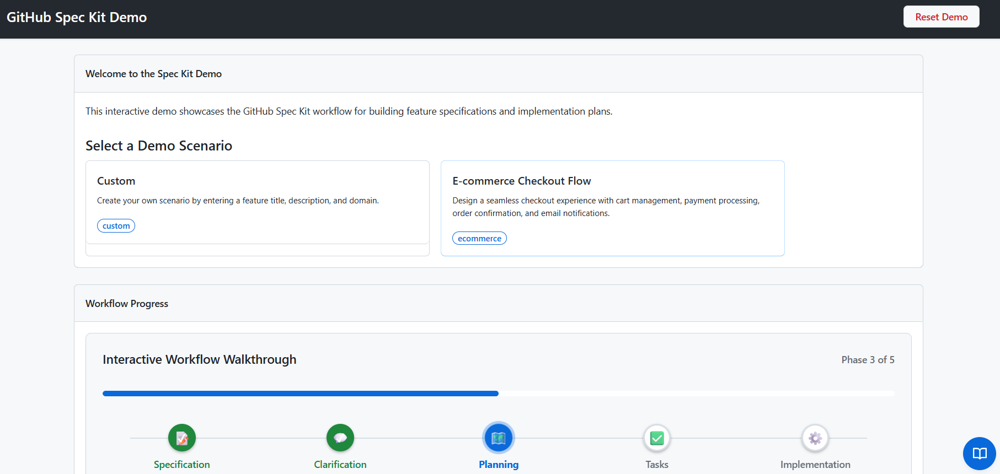

# GitHub Spec Kit Demo Application

An interactive web-based demonstration application for showcasing GitHub Spec Kit workflow capabilities to audiences during presentations and workshops.

> Note: This is currently under active development and intended for demo purposes only. It is not a production-ready application.



## Features

- **Quick Setup**: Launch in GitHub Codespaces in under 60 seconds
- **Interactive Workflow**: Step through the complete Spec Kit workflow (specify → clarify → plan → tasks → implement)
- **Constitution Showcase**: Display organizational principles and governance enforcement
- **Instant Reset**: Return to clean demo state in under 5 seconds
- **Customizable Scenarios**: Create tailored demos for specific audiences
- **Presenter Notes**: Context-aware talking points for demo presenters
- **Offline Capable**: Service worker enables offline demo capability
- **Accessible**: WCAG 2.1 AA compliant with keyboard navigation

## Quick Start

### Option 1: GitHub Codespaces (Recommended)

1. Click the green "Code" button
2. Select "Codespaces" → "Create codespace on main"
3. Wait ~60 seconds for auto-configuration
4. Open browser to `http://localhost:5000`

### Option 2: Local Development

```bash
# Clone the repository
git clone <repository-url>
cd github-spec-kit-demo

# Setup Python backend
cd backend
python3 -m venv .venv
source .venv/bin/activate  # On Windows: .venv\Scripts\activate
pip install -r requirements.txt
pip install -r requirements-dev.txt

# Set Python path
export PYTHONPATH=$PWD/src  # On Windows: $env:PYTHONPATH="$PWD\src"

# Run the application
flask run

# Open browser to http://localhost:5000
```

### Option 3: Docker

```bash
docker-compose up --build
# Open browser to http://localhost:5000
```

## Demo Workflow

1. **Select a Scenario**: Choose from pre-loaded scenarios or create a custom one
2. **Specify Phase**: Enter feature requirements in natural language
3. **Clarify Phase**: Review and answer clarifying questions
4. **Plan Phase**: View the generated technical implementation plan
5. **Tasks Phase**: See the detailed task breakdown
6. **Implement Phase**: Watch the simulated implementation

Use the **Constitution Panel** to view organizational principles and check compliance during the planning phase.

## API Endpoints

📖 **[View Full OpenAPI Documentation](specs/001-speckit-demo-app/contracts/api.openapi.yaml)** | [Open in Swagger Editor](https://editor.swagger.io/?url=https://raw.githubusercontent.com/YOUR_ORG/github-spec-kit-demo/main/specs/001-speckit-demo-app/contracts/api.openapi.yaml)

| Endpoint | Method | Description |
|----------|--------|-------------|
| `/api/health` | GET | Health check endpoint |
| `/api/scenarios` | GET | List all demo scenarios |
| `/api/scenarios/{id}` | GET | Get specific scenario |
| `/api/scenarios/custom` | POST | Create custom scenario |
| `/api/workflow/{id}` | GET | Get workflow state |
| `/api/workflow/{id}/step` | POST | Advance workflow phase |
| `/api/workflow/{id}/jump` | POST | Jump to specific phase |
| `/api/workflow/reset` | POST | Reset demo state |
| `/api/constitution` | GET | List constitution principles |
| `/api/constitution/check/{id}` | GET | Run constitution check |
| `/api/presenter-notes/{type}/{id}` | GET | Get presenter notes |

## Project Structure

```
github-spec-kit-demo/
├── backend/                    # Python Flask backend
│   ├── src/
│   │   ├── api/               # API endpoints
│   │   ├── models/            # Data models
│   │   └── services/          # Business logic
│   ├── data/
│   │   ├── scenarios/         # Demo scenario data
│   │   ├── templates/         # Artifact templates
│   │   └── presenter-notes/   # Presenter talking points
│   └── tests/                 # Test suite
├── frontend/                   # Static frontend
│   ├── src/
│   │   ├── js/               # JavaScript components
│   │   └── css/              # Stylesheets
│   └── tests/                # Playwright e2e tests
├── infra/                     # Azure Bicep infrastructure
│   ├── main.bicep            # Main template
│   ├── modules/              # Bicep modules
│   └── parameters/           # Environment parameters
├── .github/workflows/         # CI/CD pipelines
├── .devcontainer/            # GitHub Codespaces config
└── specs/                    # Feature specifications
```

## Tech Stack

- **Backend**: Python 3.11+, Flask 3.0, Gunicorn
- **Frontend**: Vanilla JavaScript, Alpine.js 3.13, Primer CSS 21.0
- **Infrastructure**: Azure App Service, Application Insights, Bicep
- **Testing**: pytest, pytest-cov, Playwright
- **CI/CD**: GitHub Actions
- **Linting**: Black, mypy, flake8, ESLint

## Development

### Run Tests

```bash
cd backend
pytest
```

### Code Formatting

```bash
cd backend
black src/ tests/
```

### Type Checking

```bash
cd backend
mypy src/
```

### Linting

```bash
cd backend
flake8 src/ tests/
```

## Documentation

- [Feature Specification](specs/001-speckit-demo-app/spec.md)
- [Implementation Plan](specs/001-speckit-demo-app/plan.md)
- [Task Breakdown](specs/001-speckit-demo-app/tasks.md)
- [Developer Quickstart](specs/001-speckit-demo-app/quickstart.md)

## Constitution

This project follows the organizational principles defined in [.specify/memory/constitution.md](.specify/memory/constitution.md):

- ✅ Code Quality Standards (Black, mypy, flake8, ESLint)
- ✅ Testing Standards (pytest, Playwright, 85% coverage)
- ✅ User Experience Consistency (Primer CSS, WCAG 2.1 AA)
- ✅ Performance Requirements (<100ms API, <50ms UI)

## License

See LICENSE file for details.

## Support

For issues or questions, please open a GitHub issue with the `[demo-app]` prefix.
